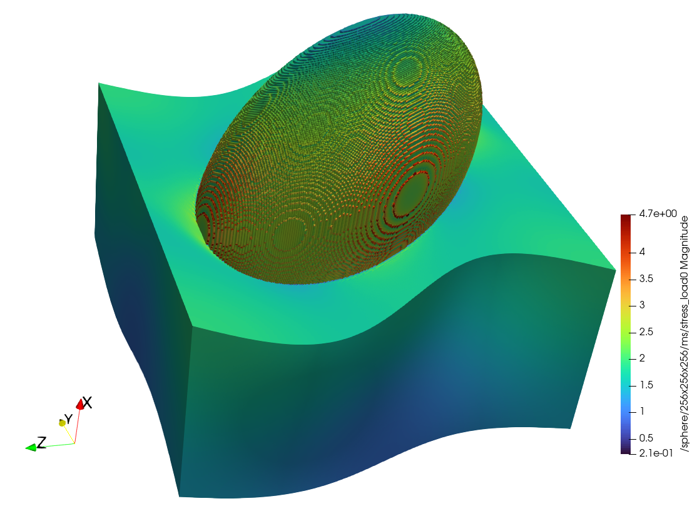

# Fourier Accelerated Nodal Solvers (FANS)

Fourier Accelerated Nodal Solvers (FANS) is an FFT-based homogenization solver designed to handle microscale multiphysics problems. This repository contains a C++ implementation of FANS, built using CMake and MPI for parallel computations.



## Table of Contents

- [Installation](#installation)
- [Usage](#usage)
- [Input File Format](#input-file-format)
- [Example](#example)

## Installation

### Prerequisites

Please ensure you have the following dependencies installed on your system:

- CMake (version 3.0 or higher)
- MPI (mpicc and mpic++)
- HDF5 with parallel support
- Eigen3
- FFTW3 with MPI support

### Building the Project

1. Clone the repository:
    ```sh
    git clone https://github.tik.uni-stuttgart.de/SanathKeshav/FANS.git
    cd FANS
    ```
2. Configure the project using CMake:
    ```sh
    cmake .
    ```

3. Compile the project using `make`:
    ```sh
    make all
    ```

The compilation will generate a binary called `FANS` in the `test/` directory.

## Usage

To run the FANS solver, you need to provide a JSON input file specifying the problem parameters. Here is the command to run FANS:

```sh
nohup /usr/bin/time -v mpiexec -n 1 ./FANS path/to/your/input_file.json &
```

## Input File Format

The input file is in JSON format and contains several fields to define the problem settings:
- `comment`: Optional field for comments.
- `ms_filename`: Path to the microstructure file (HDF5 format).
- `ms_datasetname`: Path to the dataset inside the HDF5 file.
- `ms_L`: List defining the domain size.
- `matmodel`: Material model (e.g., ThermalLinear, MechLinear, HyperElastic).
- `material_properties`: Material properties relevant to the chosen material model.
- `problem_type`: Type of the problem (thermal or mechanical).
- `method`: Solution method (`fp` for fixed point or `cg` for conjugate gradient).
- `TOL`: Tolerance for the solver.
- `n_it`: Maximum number of iterations.
- `g0`: Macroscale loading vector.

## Example

To run a linear elastic mechanical homogenization problem for a single load case on a microstructure image of size `256 x 256 x 256` with a single spherical inclusion,

```sh
mpiexec -n 1 ./FANS input_files/sphere_mech.json
```


