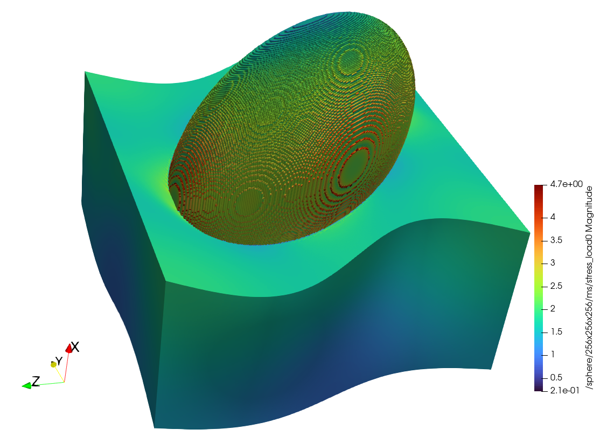

# Fourier Accelerated Nodal Solvers (FANS)

Fourier Accelerated Nodal Solvers (FANS) is an FFT-based homogenization solver designed to handle microscale multiphysics problems. This repository contains a C++ implementation of FANS, built using CMake and MPI for parallel computations.



## Table of Contents

- [Installation](#installation)
- [Input File Format](#input-file-format)
- [Examples](#examples)
- [Acknowledgements](#acknowledgements)

## Installation

### Prerequisites

Before proceeding with the installation, ensure that your system has the necessary dependencies. The prerequisites of FANS can be installed using Spack for a streamlined setup on high-performance computing systems, or through traditional package management for personal use.

The requirements are:

- A C++ compiler (e.g. GCC)
- CMake (version 3.0 or higher) (+ GNU file utility for creating .deb packages)
- Git (for cloning this repo)
- MPI (mpicc and mpic++)
- HDF5 with parallel support
- Eigen3
- FFTW3 with MPI support

### Traditional Installation

If you're setting up FANS on a personal computer or in a non-HPC environment, please use the apt package manager. For the build toolchain:

```bash
apt-get install \
    software-properties-common \
    build-essential \
    cmake \
    file \
    git
```

For the FANS dependencies:

```bash
apt-get install \
    libhdf5-dev \
    libopenmpi-dev \
    libeigen3-dev \
    libfftw3-dev \
    libfftw3-mpi-dev
```

Also we recommend to install these commonly used tools with FANS and setup a virtualenv for the `h52xdmf.py` script:

```bash
apt-get install \
    time \
    htop \
    python3 \
    python3-pip \
    python3-venv \
    python-is-python3 \
    python3-dev

python -m venv ~/venvs/FANS
source ~/venvs/FANS/bin/activate
python -m pip install h5py lxml
```

If for some reason you are unable to install these packages directly on your host machine, have a look at the [set of Docker images](docker/) to create and work with FANS within an isolated environment.

### Spack Installation (Recommended for Clusters/Supercomputers)

Spack is a package manager designed for high-performance computing environments. It simplifies the installation of complex software stacks, making it ideal for setting up FANS on large clusters or supercomputers.

1. **Install Spack**: If you don’t have Spack installed, you can set it up with the following commands:

    ```bash
    git clone https://github.com/spack/spack.git
    cd spack/bin
    source ./spack
    ```

2. **Install Dependencies**: Once Spack is set up, you can install the required dependencies:

    ```bash
    spack install cmake
    spack install mpi
    spack install hdf5 +cxx +mpi
    spack install eigen
    spack install fftw +mpi
    ```

    You can also use alternative and optimized FFTW implementations depending on your system's architecture like amdfftw (For AMD systems) or cray-fftw (For Cray systems) or fujitsu-fftw (For Fujitsu systems).

3. **Load Dependencies** Once dependencies are installed, you can load them before building:

    ```bash
    spack load cmake mpi hdf5 eigen fftw
    ```

### Building the Project

1. Clone the repository:

    ```bash
    git clone https://github.com/DataAnalyticsEngineering/FANS.git
    cd FANS
    ```

2. Configure the project using CMake:

    ```bash
    mkdir build
    cd build
    cmake ..
    ```

3. Compile the project:

    ```bash
    cmake --build . -j
    ```

The compilation will symlink the generated `FANS` binary into the `test/` directory for convenience.

### Build Options

This project supports the following CMake build options:

- `CMAKE_BUILD_TYPE`: Sets the build type. Common values are Debug, Release, RelWithDebInfo, and MinSizeRel.

- `FANS_BUILD_STATIC`: Build static library instead of shared library.
  - Default: OFF
  - Usage: `-DFANS_BUILD_STATIC=ON`

- `CMAKE_INTERPROCEDURAL_OPTIMIZATION`: Enable interprocedural optimization (IPO) for all targets.
  - Default: ON (if supported)
  - Usage: `-DCMAKE_INTERPROCEDURAL_OPTIMIZATION=OFF`
  - Note: When you run the configure step for the first time, IPO support is automatically checked and enabled if available. A status message will indicate whether IPO is activated or not supported.

### Installing the Project

After compiling, you can install FANS (system-wide) using the following options:

1. Using CMake (sudo required if --prefix is omitted):

    ```bash
    cmake --install . [--prefix <install-dir>]
    ```

2. Using .deb packages (only debian based distros; sudo required):

    ```bash
    cpack -G "DEB"
    apt install packages/fans_<version>_<architecture>.deb
    apt install packages/fans-dev_<version>_<architecture>.deb
    ```

## Input File Format

To run the FANS solver, you need to provide a JSON input file specifying the problem parameters.
Example input files can be found in the [`test/input_files`](test/input_files)  directory. You can use these files as a reference to create your own input file. The input file is in JSON format and contains several fields to define the problem settings...

### Microstructure Definition

```json
"ms_filename": "microstructures/sphere32.h5",
"ms_datasetname": "/sphere/32x32x32/ms",
"ms_L": [1.0, 1.0, 1.0]
```

- `ms_filename`: This specifies the path to the HDF5 file that contains the microstructure data.
- `ms_datasetname`: This is the path within the HDF5 file to the specific dataset that represents the microstructure.
- `ms_L`: Microstructure length defines the physical dimensions of the microstructure in the x, y, and z directions.

### Problem Type and Material Model

```json
"matmodel": "LinearElasticIsotropic",
"material_properties": {
    "bulk_modulus": [62.5000, 222.222],
    "shear_modulus": [28.8462, 166.6667]
}
```

- `problem_type`: This defines the type of physical problem you are solving. Common options include "thermal" problems and "mechanical" problems.
- `matmodel`: This specifies the material model to be used in the simulation. Examples include `LinearThermalIsotropic` for isotropic linear thermal problems, `LinearElasticIsotropic` for isotropic linear elastic mechanical problems, `PseudoPlasticLinearHardening` for plasticity mimicking model with linear hardening, and `VonMisesPlasticLinearIsotropicHardening` for rate independent J2 plasticity model with linear isotropic hardening.
- `material_properties`: This provides the necessary material parameters for the chosen material model. For thermal problems, you might specify `conductivity`, while mechanical problems might require `bulk_modulus`, `shear_modulus`, `yield_stress`, and `hardening_parameter`. These properties can be defined as arrays to represent multiple phases within the microstructure.

### Solver Settings

```json
"method": "cg",
"TOL": 1e-10,
"n_it": 100
```

- `method`: This indicates the numerical method to be used for solving the system of equations. `cg` stands for the Conjugate Gradient method, and `fp` stands for the Fixed Point method.
- `TOL`: This sets the tolerance level for the solver. It defines the convergence criterion which is based on the L-infinity norm of the nodal finite element residual; the solver iterates until the solution meets this tolerance.
- `n_it`: This specifies the maximum number of iterations allowed for the FANS solver.

### Macroscale Loading Conditions

```json
"macroscale_loading":   [
                            [
                                [0.004, -0.002, -0.002, 0, 0, 0],
                                [0.008, -0.004, -0.004, 0, 0, 0],
                                [0.012, -0.006, -0.006, 0, 0, 0],
                                [0.016, -0.008, -0.008, 0, 0, 0],
                            ],
                            [
                                [0, 0, 0, 0.002, 0, 0],
                                [0, 0, 0, 0.004, 0, 0],
                                [0, 0, 0, 0.006, 0, 0],
                                [0, 0, 0, 0.008, 0, 0],
                            ]
                        ],
```

- `macroscale_loading`: This defines the external loading applied to the microstructure. It is an array of arrays, where each sub-array represents a loading condition applied to the system. The format of the loading array depends on the problem type:

  - For `thermal` problems, the array typically has 3 components, representing the temperature gradients in the x, y, and z directions.
  - For `mechanical` problems, the array must have 6 components, corresponding to the components of the strain tensor in Mandel notation (e.g., [[ε11, ε22, ε33, ε12, ε13, ε23]]).

In the case of path/time-dependent loading as shown, for example as in plasticity problems, the `macroscale_loading` array can include multiple steps with corresponding loading conditions.

### Results Specification

```json
"results": ["stress_average", "strain_average", "absolute_error", "phase_stress_average", "phase_strain_average",
            "microstructure", "displacement", "stress", "strain"]
```

- `results`: This array lists the quantities that should be stored into the results HDF5 file during the simulation. Each string in the array corresponds to a specific result:

  - `stress_average` and `strain_average`: Volume averaged- homogenized stress and strain over the entire microstructure.
  - `absolute_error`: The L-infinity error of finite element nodal residual at each iteration.
  - `phase_stress_average` and `phase_strain_average`: Volume averaged- homogenized stress and strain for each phase within the microstructure.
  - `microstructure`: The original microstructure data.
  - `displacement`: The displacement fluctuation field (for mechanical problems) and temperature fluctuation field (for thermal problems).
  - `stress` and `strain`: The stress and strain fields at each voxel in the microstructure.

- Additional material model specific results, such as `plastic_flag`, `plastic_strain`, and `hardening_variable`, can be included depending on the problem type and material model.

### Examples

If you would like to run some example tests, you can execute the [`run_tests.sh`](test/run_tests.sh) file. For example to run a linear elastic mechanical homogenization problem for a 6 othonormal load cases on a microstructure image of size `32 x 32 x 32` with a single spherical inclusion,

```bash
mpiexec -n 2 ./FANS input_files/test_LinearElasticIsotropic.json test_results.h5
```

## Acknowledgements

Funded by Deutsche Forschungsgemeinschaft (DFG, German Research Foundation) under Germany’s Excellence Strategy - EXC 2075 – 390740016. Contributions by Felix Fritzen are funded by Deutsche Forschungsgemeinschaft (DFG, German Research Foundation) within the Heisenberg program - DFG-FR2702/8 - 406068690; DFG-FR2702/10 - 517847245 and through NFDI-MatWerk - NFDI 38/1 - 460247524. We acknowledge the support by the Stuttgart Center for Simulation Science (SimTech).
